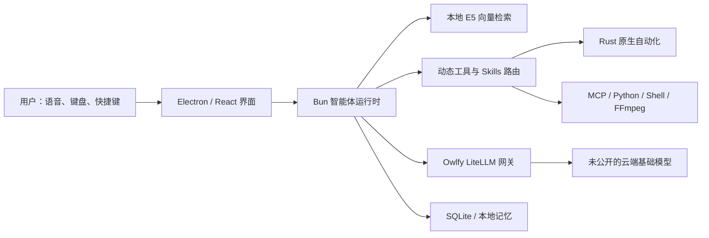

# Owlfy（原 KeyVox）技术溯源与本地客户端审计

> 调研日期：2026-07-23  
> 调研对象：Owlfy 官网、公开工商/商标线索，以及用户 Mac 上已安装的 Owlfy 1.1.8 客户端  
> 结论标记：**已确认**＝由官网、客户端文件或运行状态直接验证；**推断**＝证据支持但厂商未公开确认；**未知**＝现有公开资料与客户端均无法证明。

## 一、结论摘要

1. **Owlfy 与早期检索到的 Owl.fm 不是同一个项目。** Kevin Benscheidt、YC W19、Hyundai CRADLE/现代汽车收购以及所谓 Overengineered 复盘文章，均没有可信证据能与当前的 Owlfy 建立关系，应全部剔除。
2. 当前产品的可验证关系是 **KeyVox → Owlfy**，运营主体显示为 **Silicon Geek Co., Limited（矽基極客有限公司）**。
3. 客户端是一个 **Electron + React/Webpack + Bun + Rust 原生扩展 + SQLite** 的桌面智能体。它还自带或下载 Python、FFmpeg、uv、ripgrep 等本地工具。
4. 端侧没有发现完整的通用大语言模型，也没有发现 Whisper、FunASR、SenseVoice、Paraformer 等语音识别模型权重。唯一确认的本地 AI 模型是量化版 **Xenova/multilingual-e5-small ONNX**，主要用于记忆和技能的语义检索。
5. 当前默认的 `Standard`、`Ultra` 并非可识别的基础模型名称，而是 Owlfy 服务端的产品别名。客户端请求进入其 **LiteLLM 兼容网关**，真正上游模型被服务端隐藏，无法严谨断言是 GPT、Claude、Gemini、Qwen 或其他模型。
6. “端侧响应快”的核心不是在电脑上运行了一个大型模型，而是 **本地原生执行 + 本地语义路由 + 云端模型按需调用 + 工具懒加载** 的混合架构。

## 二、身份与公司溯源

### 2.1 可以确认的产品关系

- 国际站：[owlfy.ai](https://www.owlfy.ai/)
- 中国站：[owlfy.cn](https://owlfy.cn/)
- 旧产品/域名痕迹：`KeyVox`、`keyvox.ai`、`c.keyvox.ai`
- 客户端内部仍保留 `aido` 名称，例如 Bundle ID 为 `com.silicon-geek.aido`，说明它很可能是更早的内部代号。

因此，目前最稳妥的产品沿革表述是：

```text
Aido（内部旧代号，推断） → KeyVox（旧品牌） → Owlfy（当前品牌）
```

### 2.2 运营主体

公开页面及客户端签名线索指向：

- 公司：**Silicon Geek Co., Limited / 矽基極客有限公司**
- 香港商业登记号：`79712981`
- 查询到的登记日期：`2026-01-29`
- Apple 开发者 Team ID：`NFNT2328QC`
- 中国网站备案：`京ICP备2025125215号-7`

### 2.3 创始人、论文与专利

截至调研日：

- **创始人姓名：未知。** 官网和客户端没有给出足以交叉验证的创始团队名单。
- **论文：未发现**可可靠归属于 Owlfy 或 Silicon Geek 团队的学术论文。
- **技术专利：未发现**可可靠归属于该产品或公司的已公开专利。
- 检索到美国 `OWLFY` 商标申请，序列号 `99717554`；联系人/代理信息中出现 **RAN HE**，但这不能证明此人是创始人，也不能把同名学者的论文归到 Owlfy 名下。

换言之，现阶段将某位同名作者、论文或专利认定为 Owlfy 创始团队成果，都会超出证据范围。

## 三、此前错误信息清理

以下信息与当前 Owlfy 没有建立可信关联：

- `Owl.fm` 的所谓创始人 Kevin Benscheidt
- Y Combinator W19
- Hyundai / Hyundai CRADLE 收购或收购失败
- “push-to-listen voice OS”
- Overengineered Substack 上的 Owl.fm 架构复盘
- Dom Esposito 的同名 KeyVox 项目

这些结果主要来自同名、近似名或未经验证的搜索组合，不能继续作为 Owlfy 的背景资料引用。

## 四、客户端技术栈：本机直接验证结果

审计对象：`/Applications/Owlfy.app`，版本 **1.1.8**。

### 4.1 桌面应用框架

| 层次 | 已确认技术 | 作用 |
|---|---|---|
| 桌面壳 | Electron 31.7.7 | 跨平台窗口、渲染进程、系统集成 |
| 前端 | React、Webpack | 产品界面与交互 |
| 智能体运行时 | Bun、JavaScript | Agent 循环、工具调用、MCP、上下文管理 |
| 原生能力 | Rust N-API 扩展 | 全局快捷键、辅助功能、选中文本、模拟输入、屏幕和鼠标状态 |
| 本地数据库 | better-sqlite3 11.1.1 | 任务、历史、记忆、技能、快捷方式等 |
| 本地推理 | ONNX Runtime 1.14.0 | 运行小型嵌入模型 |
| 图像处理 | sharp 0.32.6 | 本地图像转换与预处理 |
| 音视频处理 | FFmpeg / ffprobe | 音频、视频格式及元数据处理 |
| 自动化 | `@computer-use/libnut-darwin`、Koffi | 桌面输入和原生接口调用 |
| 辅助运行环境 | Python 3.12、uv/uvx、ripgrep | 脚本、依赖、文件检索与工具执行 |

### 4.2 核心运行进程

运行时可以观察到：

- Electron 主进程、渲染进程、GPU、音频与网络进程
- `owlfyAgentRuntime.js`
- `owlfy-native-mcp-server.mjs`
- `owlfy-skill-mcp-server.mjs`
- 微信侧车服务 `wechat-ilink-sidecar/server.mjs`
- 空闲时在本机回环地址 `127.0.0.1` 的 4319、4320 端口监听

这说明 Owlfy 不是单纯网页套壳，而是包含独立智能体运行时、本地 MCP 工具服务和原生系统控制层。

### 4.3 本地数据结构

主数据库位于用户目录下的 Owlfy Application Support 中。可见的数据表包括：

- 任务会话与消息：`task_sessions`、`task_messages`、`long_tasks`
- 定时任务：`scheduled_tasks`
- 技能与 MCP：`skill_store`、`mcp_servers`、`mcp_server_tools`
- 快捷操作：`app_shortcuts`、`voice_shortcuts`、`sonic_execution_history`
- 语音：`voice_input_history`
- 历史与记忆：`clipboard_history`、`search_history`、`notification_history`、`personas`
- 用量：`usages`

部分表含有 `syncedToServer`、`lastSyncAt` 字段，因此它具备云端同步能力。“本地优先”不应被理解为“所有数据永不离开设备”。

## 五、模型清单

### 5.1 已确认的本地免费/开源模型

| 模型 | 形态 | 用途 | 结论 |
|---|---|---|---|
| `Xenova/multilingual-e5-small` | 量化 ONNX，约 129 MB（含配置与分词器） | 多语言文本向量、技能/记忆语义检索 | **本机已确认** |

模型文件位于：

```text
~/Library/Application Support/Owlfy/models/transformers/
└── Xenova/multilingual-e5-small/onnx/model_quantized.onnx
```

它是一个小型嵌入模型，不负责生成长文本，也不是语音识别模型。它能在本机快速把指令、记忆和技能转成向量，用于查找最相关的上下文。

### 5.2 未发现的本地模型

本机没有发现以下模型权重或常见格式：

- Whisper / faster-whisper
- FunASR / SenseVoice / Paraformer
- GGUF 本地大语言模型
- Core ML 语音或生成模型包
- 可独立完成 Owlfy 智能体推理的大型模型权重

客户端字符串中即使出现 `Whisper`、`FunASR` 等字样，也可能来自通用 SDK、兼容代码或历史代码；在没有权重、实际调用路径和网络证据的情况下，不能算作“正在使用”。

### 5.3 Owlfy 自有付费档位

当前配置显示：

| 产品别名 | 官方定位 | 上游基础模型 |
|---|---|---|
| `Standard` | 快速、较低额度消耗，适合日常任务 | **未知** |
| `Ultra` | 更强推理与工具调用，较高额度消耗 | **未知** |
| `Owlfy Model` / `Owlfy Agent` | 内部产品名称或任务记录名 | **未知** |
| `Memory`、`Memory Extraction`、`Memory Consolidation` | 记忆相关服务别名 | **未知** |

默认供应商标识为 `owlfy`，客户端配置指向：

```text
https://www.mcpcn.cc/litellm/v1
```

这是一个 OpenAI API 兼容的 LiteLLM 网关地址。接口返回的 `owned_by: openai` 只是兼容接口的元数据，**不能证明底层使用 OpenAI 模型**。真正的别名到上游模型映射保存在服务端，客户端安装包无法揭示。

因此，下列说法目前都不能被证实：

- Standard 就是 GPT-4o、GPT-5 或某个 Qwen 模型
- Ultra 就是 Claude、Gemini 或 DeepSeek
- Owlfy 自研了基础大模型

### 5.4 支持接入但不等于默认使用的付费模型

客户端配置包含大量 BYOK（用户自带 API Key）适配器。确认支持的供应商/默认示例包括：

| 供应商 | 客户端中出现的示例模型 |
|---|---|
| Anthropic | `claude-sonnet-4-5` |
| OpenAI（经 OpenRouter 示例） | `openai/gpt-5.4` |
| Google Gemini | `gemini-2.5-flash`；OpenRouter 示例 `gemini-3-flash-preview` |
| Alibaba DashScope | `qwen-plus` |
| Qwen Portal | `qwen3.5` |
| DeepSeek | `deepseek-chat` |
| Z.AI / GLM | `glm-5` |
| Moonshot / Kimi | `kimi-k2-turbo-preview` |
| MiniMax | `MiniMax-M3` |
| xAI | `grok-4` |
| Xiaomi MiMo | `mimo-v2-omni` |
| NVIDIA NIM | `llama-3.1-nemotron-70b-instruct` |
| Hugging Face Router | `Qwen/Qwen3.5-72B-Instruct` |
| Nous | `hermes-3-405b` |
| StepFun | `step-3.5-flash` |
| Novita | `moonshotai/kimi-k2.5` |

这些是客户端具备的接入能力，**不是 Owlfy 默认服务实际调用这些模型的证据**。

### 5.5 支持的本地大模型服务

客户端还支持：

- Ollama：`http://127.0.0.1:11434/v1`，示例模型 `llama3.1`
- LM Studio：`http://127.0.0.1:1234/v1`，示例模型 `local-model`

但本次审计时，当前生效路径是 **Owlfy Standard → mcpcn.cc LiteLLM 网关**，不是 Ollama 或 LM Studio。

## 六、语音识别技术判断

客户端原生 MCP 工具中存在 `owlfy.asr_transcribe`，其描述表明：

- 接受本地音频路径或 `audioUrl`
- 最大文件约 50 MB
- 上传和鉴权由 Owlfy 内部处理
- 后端可返回词级时间戳

结合本机没有 ASR 模型权重，可以得出：

- **已确认：**当前 Owlfy 语音转写至少存在服务端处理路径。
- **高概率推断：**默认语音输入主要依赖远程 ASR，而不是完全端侧识别。
- **未知：**具体供应商和模型名称。可能是自建服务，也可能封装第三方 API；客户端证据不足以识别。

## 七、智能体架构与技术选型

从运行时代码可以确认以下设计：

1. 智能体采用迭代式工具调用循环，默认最多约 90 轮。
2. 工具能力按任务动态激活，而不是每次把全部工具说明发送给模型。
3. 支持子智能体、上下文压缩、大型工具结果卸载和权限控制。
4. 支持 MCP HTTP/SSE、本地原生 MCP、技能 MCP。
5. 支持本地记忆预取和语义检索。
6. 能力被拆分为时间、计划、记忆、文件读写、Shell、Python、音频转写、图像理解、网页搜索、邮件、浏览器、定时任务等模块。

可将整体架构概括为：



这一技术选型的目标很明确：

- Electron/React 提高跨平台研发效率。
- Rust 承担对延迟敏感、权限敏感的系统操作。
- Bun 承担快速启动的 Agent 和 JavaScript 工具生态。
- SQLite 与 E5 ONNX 让历史、技能和记忆在本地快速召回。
- LiteLLM 统一多家模型接口，并允许服务端随时更换模型而无需更新客户端。
- MCP 与 Skills 将模型推理和具体执行解耦。

## 八、为什么端侧响应速度快

速度来源不是单一因素，而是分层架构共同作用：

### 8.1 简单动作不需要大模型生成

全局快捷键、读取当前应用、获取选中文本、模拟键鼠、粘贴文字等由 Rust 原生扩展或本地工具直接完成。只要意图已确定，这些动作的响应可以达到接近普通桌面软件的速度。

### 8.2 本地小模型先做检索和路由

`multilingual-e5-small` 体积较小，并使用量化 ONNX，在 CPU 上即可低延迟运行。它负责找到相关技能和记忆，减少发送给云端模型的上下文长度。

### 8.3 工具按需加载

Agent 不必在每次请求中携带所有工具定义，只激活相关能力。这样会减少首包输入 token、模型选择成本和工具误判。

### 8.4 本地处理文件和媒体

FFmpeg、Sharp、Python、ripgrep 等先在设备上完成格式转换、搜索和预处理，云端只接收必要内容，避免把大量原始数据全部交给模型。

### 8.5 云端模型使用产品别名

通过 Standard/Ultra 别名和 LiteLLM 网关，Owlfy 可以在服务端做路由、降级或更换模型。Standard 很可能被配置为低延迟路径，Ultra 则偏向复杂推理；但具体模型尚不能确认。

### 8.6 本地和云端分工

```text
本地：快捷键、系统控制、文件处理、数据库、记忆/技能检索
云端：复杂意图理解、规划、生成、默认语音转写
```

所以它给人的“端侧很快”体验，更准确地说是 **端云协同的快速交互**，而不是“所有 AI 都在端侧运行”。

## 九、隐私与安全观察

### 9.1 本地优先不等于纯本地

官网隐私表述存在“全部在本地处理”与“尽可能在本地处理”两种口径，而客户端已确认存在：

- 云端 LLM 网关
- 远程 ASR 路径
- 数据同步字段
- 微信等远程控制侧车服务

因此更准确的定义是：**本地优先、云端增强的混合型智能体。**

### 9.2 本地凭据

审计发现配置文件中存在可读的 API/Bearer 凭据。报告不会记录或展示该值。建议：

- 不要分享整个 `~/Library/Application Support/Owlfy` 目录。
- 若该目录、配置文件或此前的原始审计输出曾发送给他人，应退出登录或轮换相关凭据。
- 厂商更理想的做法是将令牌放入 macOS Keychain，而非普通 JSON 文件。

### 9.3 网络权限

应用声明了较宽松的网络权限，包括允许任意网络加载和本地网络访问。这符合其 MCP、局域网模型和远程控制功能，但也扩大了安全边界。该配置本身不代表它正在明文传输数据。

## 十、证据强度总表

| 问题 | 结论 | 强度 |
|---|---|---|
| KeyVox 是否更名为 Owlfy | 是，存在产品与域名迁移痕迹 | 高 |
| 是否与 Owl.fm/YC/Hyundai 有关 | 无可靠证据，应剔除 | 高 |
| 创始人是谁 | 公开资料不足 | 未知 |
| 是否有团队论文/专利 | 未找到可可靠归属的记录 | 未知 |
| 是否有本地模型 | 有 multilingual-e5-small 嵌入模型 | 高 |
| 是否有本地大语言模型 | 未发现 | 高（针对本次安装） |
| 默认语音是否纯本地 | 不是，至少存在远程 ASR 路径 | 高 |
| Standard/Ultra 的真实模型 | 服务端隐藏 | 未知 |
| 是否支持第三方付费模型 | 支持多家 BYOK | 高 |
| 当前是否使用 Ollama/LM Studio | 支持但未启用 | 高 |
| 为什么响应快 | 原生执行、本地检索、懒加载、端云分工 | 高/部分推断 |

## 十一、仍需进一步验证的事项

若要继续把“未知”变成“已确认”，最有效的下一步是：

1. 在执行一条无敏感内容的 Standard 和 Ultra 测试任务时，只记录请求域名、响应头、首 token 延迟和模型元数据，比较两条服务端路径。
2. 对一次无敏感内容的语音转写记录目标域名和请求时序，以确认 ASR 服务部署位置；除非服务端主动返回模型标识，否则仍未必能确定供应商。
3. 检查安装包的第三方许可证和 source map，寻找被打包代码对应的上游开源项目。
4. 等待公司公开团队页面、招聘信息、技术博客、专利申请或学术主页，再对创始人及研究成果做双源交叉验证。

## 十二、最终判断

Owlfy 的真正技术特点不是“在电脑里塞入一个神秘大模型”，而是把桌面自动化、智能体运行时、本地语义检索、技能系统和云端模型网关组合成一套低延迟工作流。它确实使用了本地开源模型和大量开源组件，但核心生成模型与 ASR 模型被服务端抽象层隐藏，现阶段不能可靠点名。

对外最严谨的表述应是：

> Owlfy 是 Silicon Geek 推出的本地优先桌面智能体，前身为 KeyVox。客户端使用 Electron、Bun、Rust、SQLite、ONNX Runtime、MCP 和本地 multilingual-e5-small 嵌入模型；默认生成与语音识别仍包含云端服务。Standard/Ultra 是产品档位而非已公开的基础模型名称，真实上游模型尚无可验证披露。
