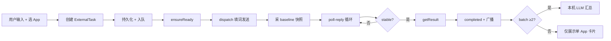
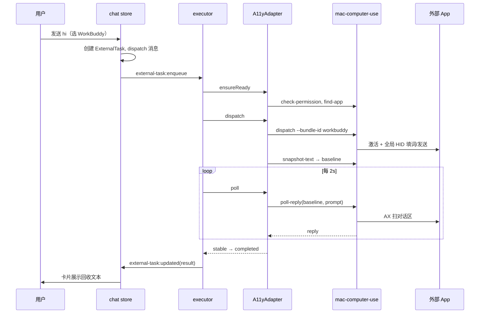

# 外部任务派发与回收方案

> **版本**: v1.0  
> **日期**: 2026-08-10  
> **状态**: 已实现（真实执行路径）；本文整理当前架构、全流程与设计取舍  
> **关联文档**: [`APP_ORCHESTRATOR.md`](./APP_ORCHESTRATOR.md)、[`codex调研报告.md`](./codex调研报告.md)、[`P1_MOCK_COMPLETED.md`](./P1_MOCK_COMPLETED.md)

---

## 0. 一句话

AIThink 作为**本机编排台**，把用户问题「派」给**用户已打开且已登录**的外部 Agent App（豆包 / 千问Work / WorkBuddy），通过 **macOS 辅助功能 + 魔法箭头（全局 HID 事件）** 完成填词、发送与结果回收；多 App 并发时由**本机 LLM** 汇总各来源回复。

**不做的事**：不 spawn 新实例、不代管用户账号、不调用各 App 的非公开 API。

---

## 1. 背景与演进思路

### 1.1 产品目标

用户在一个输入框里提问，可选择：

- **本机对话**：走 AIThink 内置模型；
- **外部 App**：同一问题同时派给 1～3 个已安装 Agent，回收后展示各 App 卡片，≥2 个来源时自动生成「汇总回答」。

这与 Codex 控制台「派给 @Browser / @Computer」同构：**编排层统一，执行面异构**。

### 1.2 技术路线演变（思考过程）

| 阶段 | 假设 | 结论 |
|------|------|------|
| P0 体检 | 三 App 均为 Electron → CDP 最优 | CDP 需控制调试端口；**不能假设用户日常实例已开 remote-debugging** |
| P1 | Mock 任务流验证 UI | 任务模型、dispatch 卡片、汇总 UX 跑通 |
| P2 纠偏 | **只操控用户已打开的日常窗口** | 放弃 spawn + CDP 为主路径；改为 **Accessibility + 模拟输入** |
| P2+ | WorkBuddy / 豆包实测 | `postToPid` 对 Electron 常无效 → WorkBuddy 必须 **激活前台 + 全局 HID** |
| 结果回收 | 无 DOM API | 只能 **AX 扫窗口文本 + baseline 差分**；长回复受可视区域限制 |

**当前定论**：执行面 = **A11y 读控件树 + 魔法箭头发事件**；CDP 保留为远期可选增强，非主路径。

### 1.3 与旧文档的差异

| 项 | APP_ORCHESTRATOR v0.4 | **当前实现** |
|----|----------------------|-------------|
| 近期 App | QoderWork 等 | **豆包**（`doubao`）、千问Work、WorkBuddy |
| 驱动 | 文档写 CDP 档 | **A11y + HID**（`native/mac-computer-use`） |
| 触发 | 关键词（P1 Mock） | InputBar 显式切换「外部 App」 |
| 执行 | Mock 定时器 | `external-task-executor` 真实队列 |

---

## 2. 架构分层

```
┌─────────────────────────────────────────────────────────────┐
│  Frontend (Vue + Pinia)                                      │
│  InputBar · chat store · MessageBubble(dispatch 卡片)        │
└───────────────────────────┬─────────────────────────────────┘
                            │ IPC (preload invoke / on)
┌───────────────────────────▼─────────────────────────────────┐
│  Electron Main                                               │
│  external-task controller · executor · summarize-service       │
│  AppAdapter (a11y-electron / doubao)                         │
└───────────────────────────┬─────────────────────────────────┘
                            │ spawn CLI, JSON stdout
┌───────────────────────────▼─────────────────────────────────┐
│  native/mac-computer-use (Swift)                             │
│  find-app · dispatch · snapshot-text · poll-reply            │
│  AX 树遍历 · 全局/进程级 HID · 魔法箭头 overlay               │
└───────────────────────────┬─────────────────────────────────┘
                            │ Accessibility + CGEvent
┌───────────────────────────▼─────────────────────────────────┐
│  用户已打开的外部 App（豆包 / 千问Work / WorkBuddy）          │
└─────────────────────────────────────────────────────────────┘
```

### 2.1 核心模块与路径

| 层级 | 路径 | 职责 |
|------|------|------|
| UI | `frontend/src/components/InputBar.vue` | 派发模式、多选 App、发送 |
| 状态 | `frontend/src/stores/chat.ts` | 建任务、监听更新、batch 汇总 |
| IPC | `electron/controller/external-task.ts` | enqueue / cancel / retry / summarize-batch |
| 执行 | `electron/service/external-task-executor.ts` | 队列、按 App 互斥、poll 循环 |
| 适配 | `electron/service/adapters/a11y-electron-adapter.ts` | 封装 mac-computer-use 调用 |
| 汇总 | `electron/service/external-task-summarize-service.ts` | 本机 LLM 综合多源 |
| 原生 | `native/mac-computer-use/Sources/main.swift` | AX + 输入 + 快照 + 差分抽取 |
| 类型 | `shared/types.ts` | `ExternalTask`、`AppAdapter`、`batchId` |

---

## 3. 全流程（端到端）

### 3.1 阶段总览



### 3.2 前端：派发

1. **InputBar** `handleSend()`  
   - `dispatchMode === 'external'` → `chatStore.dispatchToExternalApp(prompt, model)`  
   - 多选 App 时走 `dispatchMultipleTasks`，共享 `batchId = batch-${timestamp}-${random}`。

2. **chat store**  
   - 确保会话存在（`ensureDispatchSession`）；插入用户消息。  
   - 每个 App 创建一条 `ExternalTask`（`queued`）。  
   - 插入 `kind=dispatch` 消息，内嵌 `dispatchTasks[]` 卡片。  
   - `agent:save-external-task` 落库；`external-task:enqueue` 触发执行。  
   - 多 App 入队 **错峰 500ms**，减轻同时抢焦点。

3. **等待锁**  
   - 当前会话存在 `queued` / `running` 任务时，InputBar 禁用并提示「等待外部任务」；可「新建对话」切走（按会话维度，非全局锁）。

### 3.3 Electron：队列与执行

**`enqueueExternalTask(taskId)`** → `drainQueue()`：

- 全局 FIFO；**同一 `appId` 同时只跑一个任务**（`runningByApp` 互斥）。  
- 不同 App **可并行**（各自 adapter 实例）；WorkBuddy 派发时会短暂激活前台，可能与并行冲突，属已知体验折中。

**`runOne(taskId)`** 生命周期：

| 步骤 | progress | 动作 |
|------|----------|------|
| 1 | 5 | `status=running`，`ensureReady()` |
| 2 | 20 | `adapter.dispatch()` |
| 3 | 25～90 | 每 **2s** `adapter.poll()`，直到 `completed` 或超时 |
| 4 | 100 | `getResult()` → `status=completed`，写入 `result` |
| finally | — | `releaseControl()` → `control-end` 释放 overlay |

超时：`EXTERNAL_TASK_TIMEOUT_MS`（默认 15 分钟）。

取消 / 重试：`external-task:cancel` / `retry`；abort 标志 + adapter.cancel。

每次状态变更 **`external-task:updated`** 广播至所有窗口，前端 `applyExternalTaskUpdate` 刷新卡片。

### 3.4 适配器：dispatch

**`A11yElectronAdapter.dispatch()`**（豆包 / 千问Work / WorkBuddy 共用，差异在 native `--bundle-id`）：

1. `check-permission` — 辅助功能是否授权。  
2. `find-app --bundle-id` — 查找**已运行**实例，取 `pid`；无窗口则失败。  
3. **`dispatch --pid --prompt --bundle-id`** — 定位输入框、填入、发送（见 §4）。  
4. **派发成功后** sleep 400ms → **`snapshot-text --pid`** → 存 `baselineTexts[]`。

> **为何 baseline 在 dispatch 之后？**  
> 避免把用户刚发出的 prompt 或发送过程中的 UI 抖动算进「新增回复」。

### 3.5 适配器：poll 与 stable

**`poll-reply --pid --prompt --baseline-json`** 每次调用：

1. native 再 `snapshot-text` 得 `currentTexts`。  
2. `extractReplyFromSnapshots(current, baseline, prompt)` 得 `reply`。  
3. adapter 层 **stable 判定**：
   - `STABLE_NEEDED = 3`：连续 3 次 `reply === lastReply`；  
   - 长度 ≥ `max(4, min(80, prompt.length + 8))`；  
   - 若 reply 变长 → 重置 stable（流式输出中）；  
   - 达标后再 **多 poll 一次**，尽量带上流式末尾。

`getResult()` 返回内存中的 `taskResult`（不在 poll 外再次扫屏）。

### 3.6 前端：结果展示与 batch 汇总

- 单任务：`dispatch` 卡片内展示 `status`、`result`、`error`、`logs`。  
- batch：同 `sessionId` + 同 `batchId` 且 **≥2 任务**、全部终态 → `external-task:summarize-batch`。  
- 汇总：`summarizeExternalTaskResults` 调本机 `generateText`；失败则 `buildFallbackSummary` 拼接。  
- 汇总消息 `kind=task-result`，`blockTitle`：「汇总回答」。

---

## 4. 原生层：派发与发送（mac-computer-use）

CLI 入口：`native/mac-computer-use/mac-computer-use`  
构建：`npm run build:computer-use`

### 4.1 命令一览

| 命令 | 用途 |
|------|------|
| `check-permission` | AX 授权 |
| `find-app --bundle-id` | pid + 窗口 bounds |
| `dispatch --pid --prompt [--bundle-id]` | 填词 + 发送 |
| `snapshot-text --pid` | 对话区文本快照 |
| `poll-reply --pid --prompt --baseline-json` | 差分抽取 reply |
| `control-end` | 隐藏魔法箭头 overlay |
| `run-task` | 一体化 dispatch+poll（**executor 未用**，便于 shell 调试） |

### 4.2 dispatch 内部逻辑

```
findBestEditableElement(bundleId)
  → fillComposer（点击聚焦、必要时粘贴/打字）
  → submitComposer（发送）
  → verifyMessageSent（输入框清空 / 进入会话页 / 对话区出现 prompt）
```

**输入框定位（WorkBuddy 特化）**：

- 首页大框：`y < 620`；会话页底栏：`y > 650`。  
- 排除 footer：`AXComboBox`、「默认权限」「Auto」「选择工作空间」等（曾误选 ComboBox 导致 `composerPreview: 默认权限`）。  
- 取面积最大的 `AXTextArea`。

**发送（WorkBuddy 特化）**：

| 页面 | 策略 | 原因 |
|------|------|------|
| 首页 | 聚焦输入框 → **Return（全局 HID）** | 发送钮在 AX 树中常非标准 Button；坐标点击 + postToPid 无效 |
| 会话页 | 全局点击发送钮区域 / AX Press | 与首页不同布局 |
| 共通 | **`ensureAppFrontmost` + `CGEvent.post(.cghidEventTap)`** | Electron 下 `postToPid` 键盘/鼠标不可靠 |

**豆包 / 千问Work**：

- 通用 `fillComposer` + `findSendButton` + Cmd+Enter / Enter。  
- 曾修：豆包 `maxDepth`、坐标过滤、prompt 锚点、多段回复拼接、Swift Dictionary 重复 key 崩溃等。

**WorkBuddy React 输入框**：

- 禁止对空编辑器 `Cmd+A+Delete`（会触发 React `removeChild` 报错）。  
- 清空仅用 Backspace；首页已有 prompt 时 **不清空、直接发送**。

### 4.3 native 错误码

| code | 含义 | 用户侧提示 |
|------|------|-----------|
| `composer_not_found` | AX 无输入框 | 窗口可见、已登录 |
| `input_not_accepted` | 未写入真实编辑器 | WorkBuddy 可点「重置输入框」 |
| `send_not_accepted` | 已填入但未发出 | 窗口前台、输入框无报错 |
| `no_accessibility` | 未授权 AX | 系统设置勾选 AIThink |
| `app_not_running` | 未找到进程 | 先打开 App |

---

## 5. 结果回收：快照与差分（思考过程）

> 用户问：「WorkBuddy 回复很多，AIThink 里为什么偏短？」——以下为机制说明，**当前版本有意不做大改**，先文档化边界。

### 5.1 为什么不能读「完整 DOM」

主路径未接 CDP，只能：

1. 遍历 **Accessibility 树**，读 `AXStaticText` / `AXTextArea` 的 value/title；  
2. 用 **屏幕坐标** 过滤「主对话列」、排除侧边栏与 composer 自身。

### 5.2 快照：`collectConversationTexts`

条件（简化）：

- 与 composer **同列**：`midX >= composer.minX - 100`  
- **不在** composer 矩形内  
- **垂直带**：`frame.maxY <= composer.maxY + 120`  

**关键取舍**：只采输入框上方约 **120px 可见带**，不是整段聊天滚动区。  
→ 长回复一旦滚出该带，AX **扫不到**，这是「回收偏短」的**首要原因**。

WorkBuddy 长文常被拆成 **多个 AX 文本节点**（段落、列表、小标题），后续再拼接。

### 5.3 差分：`extractReplyFromSnapshots`

1. **`findPromptAnchor`**：在 `currentTexts` 中找用户 prompt **最后一次**出现。  
2. 只保留 **prompt 之后** 的片段。  
3. **`keep()` 过滤**：App 名、时间戳、「共消耗」、UI chip、baseline 已有句、豆包意图标签等。  
4. 多段 **`reversed().joined("\n")`**（AX 按 Y 降序采集，反转成阅读顺序）。  
5. 从 prompt 往后扫描时，若命中 `priorTexts` 会 **`break`**——多气泡长回复可能在此截断。

### 5.4 stable 与「流式未完成」

- poll 每 2s；reply 连续 3 次不变且够长 → 完成。  
- 若 AX 快照不再变长（上面段落不在 120px 带内），会在 **当前可见长度** 停止，不等于 App 内全文结束。

### 5.5 若未来要「更完整」（备忘，非本期）

| 方向 | 代价 |
|------|------|
| 放宽垂直带 / 按窗口高度比例 | 侧边栏噪声增多 |
| poll 结束前自动滚对话区 | 需额外 scroll 动作 + 焦点干扰 |
| 弱化 `priorTexts break` | 可能混入历史轮次 |
| CDP 读 DOM（用户实例可调试时） | 需端口/安全策略，与「日常实例」原则冲突 |

---

## 6. 多 App 并发与汇总

### 6.1 并发模型

```
用户一次发送 → N 个 ExternalTask（同 batchId）
     ↓
前端 stagger 500ms enqueue
     ↓
Executor 全局队列 + per-appId 互斥
     ↓
豆包、千问Work、WorkBuddy 可并行（各自 poll）
     ↓
WorkBuddy dispatch 会 activate → 短暂抢前台
```

### 6.2 汇总触发条件

同一会话、同一 `batchId`、任务数 ≥ 2、无 `queued`/`running`、该 batch 未汇总过 → `summarizeExternalBatch`。

汇总输入：用户原问题 + 各 App 的 `result` / `error`；输出写入 `summary-${batchId}` 消息。

---

## 7. 数据模型与 IPC

### 7.1 ExternalTask（摘要）

```typescript
ExternalTask {
  id, sessionId, appId, appName, prompt,
  batchId?,           // 多 App 批次
  triggerMessageId?,  // 关联用户消息
  status,             // queued | running | completed | failed | cancelled
  progress?, logs?, result?, error?,
  createdAt, startedAt?, completedAt?
}
```

### 7.2 IPC

| Channel | 方向 | 说明 |
|---------|------|------|
| `external-task:enqueue` | → main | 开始执行 |
| `external-task:cancel` | → main | 取消 |
| `external-task:retry` | → main | 重试 failed/cancelled |
| `external-task:summarize-batch` | → main | 本机 LLM 汇总 |
| `external-task:updated` | ← renderer | 任务状态广播 |
| `agent:save-external-task` | → main | 持久化 |
| `agent:list-external-tasks` | → main | 启动恢复 |

持久化：`database.ts` 内 `externalTasks[]` JSON。重启后 `queued`/`running` → 标记失败「应用重启，任务已中断」。

### 7.3 环境变量

| 变量 | 默认 | 说明 |
|------|------|------|
| `DOUBAO_BUNDLE_ID` | `com.bot.pc.doubao` | 豆包 |
| `QWENWORKCN_BUNDLE_ID` | `cn.qwenwork.desktop.mac` | 千问Work |
| `WORKBUDDY_BUNDLE_ID` | `com.workbuddy.workbuddy` | WorkBuddy |
| `EXTERNAL_TASK_TIMEOUT_MS` | 900000 | 15 分钟 |
| `AITHINK_COMPUTER_USE_BIN` | 内置路径 | helper 二进制 |

---

## 8. 用户体验与运维

### 8.1 前置条件（用户）

1. 目标 App **已打开且已登录**（日常实例）。  
2. **辅助功能**授权 AIThink / `mac-computer-use`。  
3. App 窗口在**当前桌面可见**（非最小化到其他 Space）。  
4. WorkBuddy：输入框报红时可点 **「重置输入框」**。

### 8.2 魔法箭头

- dispatch / poll 期间可显示 **橙色箭头 overlay**（`flashCursor` / `CursorOverlay`）。  
- 任务结束或应用退出：`control-end` 释放，避免残留「控制指示器」。

### 8.3 开发

```bash
cd aithink-client
npm run build:computer-use   # Swift 变更后必跑
npm run dev                  # electron 启动时会再 build 一次
```

---

## 9. 已知限制（诚实边界）

| 类别 | 限制 |
|------|------|
| 执行面 | 无 API；GUI 自动化脆性随 App 发版变化 |
| WorkBuddy | 派发需短暂前台；首页/会话页两套 composer |
| 回收 | AX 仅近 composer 可见带；长回复不全 |
| 并发 | 同 App 串行；WorkBuddy 激活影响并行体验 |
| 汇总 | 依赖本机模型；某 App 失败时仅综合有效源 |
| 文档 | P1_MOCK、APP_ORCHESTRATOR 部分章节已过时，以本文 + 代码为准 |

---

## 10. 后续演进方向（未承诺）

1. **Adapter 插件化**：新 App 仅增 bundleId + 可选 native 特化块。  
2. **CDP 可选档**：用户显式开启调试端口时，DOM 级读写作增强。  
3. **回收增强**：滚动采集、分段 stable、按 App  tuning 垂直带。  
4. **Computer Use 视觉档**：AX 读不到时的降级（对齐 codex 调研）。  
5. **Sidecar**：与 [`APP_ORCHESTRATOR.md`](./APP_ORCHESTRATOR.md) 一致，编排台验证后再考虑内部 agent 迁 Python。

---

## 附录 A：单次任务时序（详）



---

## 附录 B：关键源码索引

| 主题 | 文件 |
|------|------|
| 派发入口 | `frontend/src/stores/chat.ts` → `dispatchToExternalApp` |
| 队列执行 | `electron/service/external-task-executor.ts` → `runOne` |
| Poll stable | `electron/service/adapters/a11y-electron-adapter.ts` |
| AX 快照 | `native/mac-computer-use/Sources/main.swift` → `collectConversationTexts` |
| 差分抽取 | `main.swift` → `extractReplyFromSnapshots` |
| WorkBuddy 发送 | `main.swift` → `submitWorkBuddy`, `useGlobalEvents` |
| Batch 汇总 | `electron/service/external-task-summarize-service.ts` |

---

*本文描述截至 2026-08-10 的代码行为；若实现变更，请同步更新版本号与 §1.3 差异表。*
