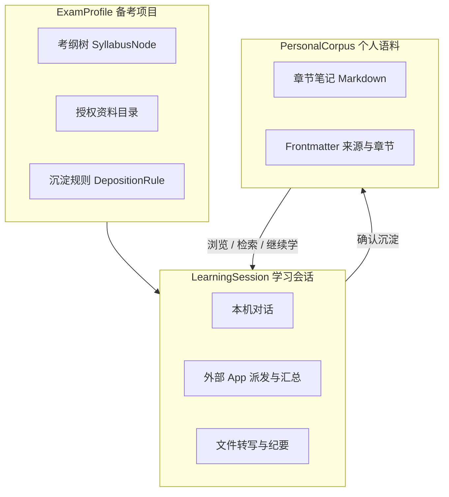
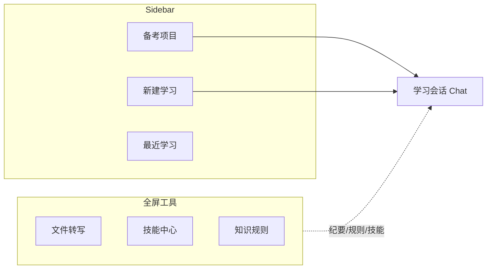
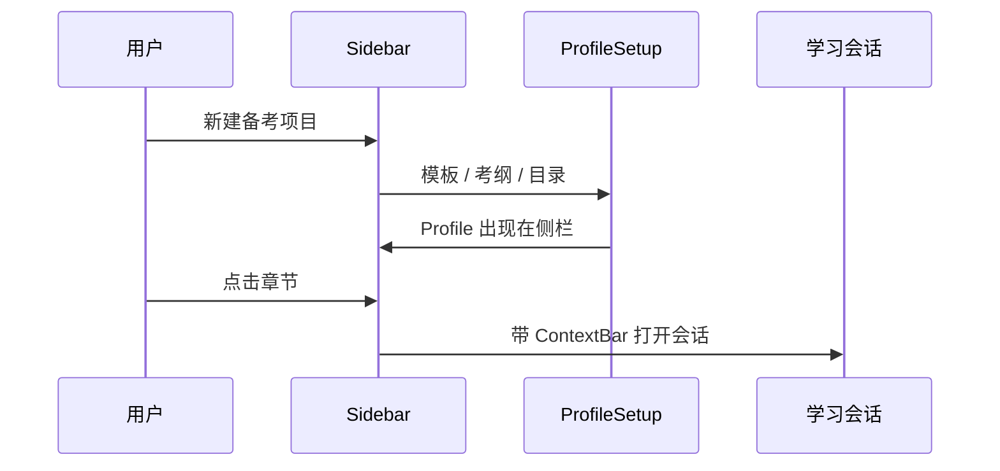
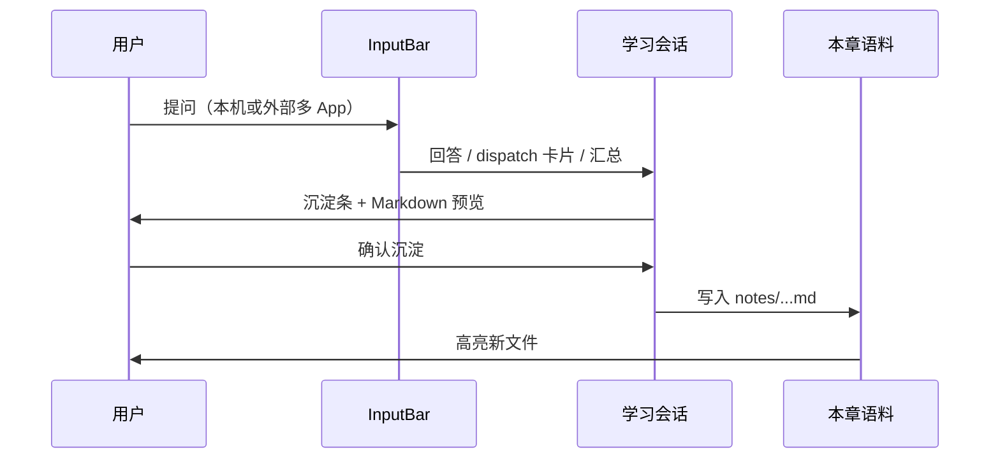
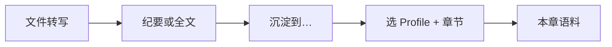

# 考试备考与知识沉淀方案

> **版本**: v1.0  
> **日期**: 2026-08-10  
> **状态**: 产品战略 / 界面方案（未实现闭环后端）  
> **关联文档**: [`外部任务派发与回收方案.md`](./外部任务派发与回收方案.md)、[`APP_ORCHESTRATOR.md`](./APP_ORCHESTRATOR.md)、[`FEATURE_REQUIREMENTS.md`](../FEATURE_REQUIREMENTS.md)

---

## 0. 一句话

AIThink 面向 **任意考试 / 认证备考**，提供本地优先的 **「学习 → 沉淀 → 复习」知识生产线**：在学习会话里问、听、多源对照，**确认后**写入按考纲组织的个人语料；系统分析师只是其中一个 **ExamProfile 示例**，不是产品边界。

**不是**：通用 AI 个人工作台、Chat 替代品、题库 / 模考 App。

---

## 1. 为什么不是「个人工作台」

「个人工作台」描述的是 **集成野心**（把能力堆在一个控制台里），不是 **使用动机**。

vibecoding 时代，集成成本极低，大量产品看起来都像工作台，但留存曲线往往像 side project：造完、展示、搁置。常见原因：

| 假设 | 现实 |
|------|------|
| 用户有稳定工作流 | 多数是零散需求，没有「每天打开总控台」的习惯 |
| 多 App 集成本身有价值 | 若不能变成 **可复习的资产**，多一层只是切换成本 |
| 造出来就会用 | 维护、失败重试、沉淀缺失，导致回到豆包 / ChatGPT 单点入口 |

**备考场景不同**：有明确目标（通过考试）、明确周期（数月）、明确产出（自己的笔记 / 错题 / 案例库）。用户会为 **通过考试** 反复打开工具——这是 **任务驱动**，不是 **仪表盘驱动**。

本产品主张：

> **学习会话是可沉淀的中间态，不是终点。**  
> 外部 App 派发是「多源输入管道」，不是编排仪表盘的目的。

---

## 2. 与别的平台比：缺的不是单点，是闭环

**不是「别的平台完全不具备」**，而是各覆盖一段，用户需人工拼接：

| 平台类型 | 擅长 | 备考知识沉淀的缺口 |
|---------|------|-------------------|
| 豆包 / ChatGPT / Kimi | 讲题、模拟问答 | 对话在云端；难按考纲长期结构化；多源结果需手动复制 |
| Notion / Obsidian / 语雀 | 笔记、双链、本地文件 | 弱「多 App 异步问 + 汇总入笔记」 |
| 题库 / Anki | 刷题、记忆曲线 | 弱理解型讲解；内容常非学习过程自然长出 |
| Owlfy 等 Agent 桌面 | 本地记忆 + 向量检索 | 偏助手记忆，非按考纲组织的备考语料 |

**AIThink 差异主张**（待 Phase A 落地后验证）：

**学 → 筛 → 沉 → 用** 在同一壳内完成，且 **沉** 是显式确认、按章节落盘、带来源溯源。

---

## 3. 抽象模型（任意考试）

系统分析师、法考、PMP、英语考试等，共用同一套骨架；只换 **ExamProfile 模板**（大纲、目录结构、默认提示）。



### 3.1 核心概念

| 概念 | 含义 | 系统分析师示例 | 抽象后 |
|------|------|----------------|--------|
| **ExamProfile** | 一次备考项目 | 软考系分 2026 | 任意考试；新建时选模板 |
| **SyllabusNode** | 考纲树节点 | 「软件架构」「案例题」 | 可导入 Markdown 大纲或手建 |
| **LearningSession** | 一次学习行为 | 问「DFD 与 UML 区别」 | 绑定 Profile + 可选章节 |
| **KnowledgeArtifact** | 沉淀产物 | `notes/03-架构/DFD-vs-UML.md` | 统一 Markdown + 元数据 |
| **DepositionRule** | 何时写入语料 | 每次询问 / 默认沉淀 | 见 [`KnowledgeSpaceView.vue`](../../frontend/src/views/KnowledgeSpaceView.vue) mock（KS-306） |

### 3.2 抽象原则

- **换考试 = 换 Profile 模板**，不换产品骨架（导航、Chat、沉淀条、语料栏）。
- **物理目录**复用现有 [`WorkspaceSpace`](../../shared/types.ts)（`folderPath` = Profile 根目录）。
- **逻辑会话**复用现有 `Session`，扩展 `profileId` / `syllabusNodeId`（实现期再定字段）。

### 3.3 沉淀产物 Frontmatter（建议）

写入 `notes/` 下 Markdown 时，统一头部元数据，便于检索与溯源：

```yaml
---
profileId: profile-xxx
syllabusPath: "03-软件架构"
title: "DFD 与 UML 的区别"
sources:
  - type: local-llm
  - type: external-summary
    apps: [doubao, workbuddy]
sessionId: session-xxx
createdAt: 2026-08-10T12:00:00+08:00
---
```

---

## 4. 与现有 AIThink 能力映射

| 能力 | 现状 | 在闭环中的角色 |
|------|------|----------------|
| 本机对话 + Agent | **已有** | 「学」 |
| 外部 App 派发 + batch 汇总 | **已有**（见 [外部任务派发与回收方案](./外部任务派发与回收方案.md)） | 「多源学 + 筛」 |
| 文件转写 + 结构化纪要 | **已有** | 「听 / 读 → 笔记原料」 |
| `WorkspaceSpace` + 右栏产物树 | **已有** | Profile 物理目录、`notes/` 展示 |
| 知识空间 UI | **Mock**，无 `knowledge:*` IPC | 授权目录 + 沉淀规则配置页原型 |
| 向量检索 | README TODO | Phase B「用」 |
| 考纲树 / 沉淀条 / ContextBar | **未实现** | 闭环 UI 缺口 |
| 错题卡片 / 自测 | **未实现** | Phase C（可选） |

**诚实边界**：外部回收受 AX 可视带限制，长回复可能不全；沉淀应以 **用户确认后的内容** 为准，而非盲目信任回收全文（见外部任务方案 §5）。

---

## 5. 界面设计：信息架构

**原则**：复用现有 [`App.vue`](../../frontend/src/App.vue) 三栏壳（Sidebar | 主区 | RightPanel），用 **ExamProfile 升级「空间」语义**，不另做第五套工作台。

### 5.1 导航模型



| 区域 | 现名 | 方案名 | 作用 |
|------|------|--------|------|
| 顶栏 CTA | 新建任务 | **新建学习** | 在当前 Profile + 章节下开 LearningSession |
| 侧栏 | 空间 | **备考项目** | 列表 = ExamProfile |
| 侧栏二级 | 空间下会话 | **考纲 + 最近** | 展开 Profile → 章节树 + 该章历史会话 |
| 全屏 | 知识空间 | **知识规则** | 授权文件夹、沉淀策略 |
| 全屏 | 文件转写 | 不变 | 录音 / 视频 → 纪要 → 可沉淀 |
| 主区 | Chat | **学习会话** | 问答、派发、汇总、**沉淀确认** |
| 右栏 | 产物 | **本章语料** | 当前 Profile / 章节下 `notes/*.md` |

Phase C 之前 **不做独立「复习模式」大页**：复习 = Sidebar 选章 + 右栏读语料 +「在本章继续学习」回 Chat。

### 5.2 Chat 三栏布局（串联核心）

```
┌ Sidebar ──────────┬─ Chat 主区 ────────────────────────┬─ RightPanel ────┐
│ [新建学习]         │ ┌ ContextBar ───────────────────┐ │ [本章语料|问题] │
│ ▼ 软考·系分 2026   │ │ Profile › 03软件架构 › 切换      │ │ notes/*.md    │
│   ├ 01综合知识 ●   │ └───────────────────────────────┘ │ │ 新沉淀高亮    │
│   ├ 02案例题   ○   │  user / assistant / dispatch      │                 │
│   └ …              │  ┌─ 沉淀条 ──────────────────────┐ │                 │
│ 最近               │  │ [预览][章节▾][沉淀][忽略]      │ │                 │
│ 文件转写 / 知识规则│  └───────────────────────────────┘ │                 │
│                    │  InputBar: 本机 | 外部 App        │                 │
└────────────────────┴───────────────────────────────────┴─────────────────┘
```

**ContextBar（新）**  
始终显示当前 `ExamProfile` + `SyllabusNode`；切换章节后，InputBar placeholder 与 Agent 系统提示带上章节 scope。

**沉淀条（新，Phase A 核心 UI）**  
出现在：本机 assistant 消息、外部汇总消息（`kind=task-result`）、转写纪要完成后。  
行为：**预览 → 选章节 → 确认沉淀 / 忽略**；遵守 Profile 级 DepositionRule（每次询问 / 默认不沉淀 / 默认沉淀）。

**本章语料（右栏演进）**  
由当前「空间产物」过滤为 `{profileRoot}/notes/{syllabusPath}/**`；沉淀成功后高亮新文件。

### 5.3 知识规则页（KnowledgeSpaceView 演进）

保留全屏「授权文件夹 + 沉淀规则」，与 Profile **关联**：

- 每个 Profile 绑定根目录（= `WorkspaceSpace.folderPath`）
- 规则项（对齐 mock KS-306）：临时文件、临时网页、**对话结论**、**任务产物**
- 可按 Profile 覆盖全局默认

### 5.4 新建备考项目（Setup）

向导步骤（可 Modal，不必独立 App）：

1. 选择 **考试模板**（空白 / 导入 Markdown 大纲 / 未来：官方模板包）
2. 命名 Profile，选择 **本地根目录**
3. 可选：添加授权资料文件夹（跳转知识规则）

系统分析师模板仅作为 **预置 SyllabusNode 示例**，不作为产品名称。

---

## 6. 四条主路径（界面串联）

### 6.1 路径 A — 从零开始一个考试



### 6.2 路径 B — 学习 → 沉淀（核心闭环）



**外部 App 派发必须接入同一条沉淀条**：汇总完成后不得停留在 dispatch 卡片内与语料脱节。

### 6.3 路径 C — 听课 / 讲义 → 沉淀



[`FileTranscriptionView.vue`](../../frontend/src/views/FileTranscriptionView.vue) 纪要完成页增加 **「沉淀到备考项目」**，复用 Chat 沉淀条组件与 IPC。

### 6.4 路径 D — 复习（Phase A/B 极简）

1. Sidebar：展开 Profile，章节旁 **●** 表示已有语料  
2. RightPanel：浏览该章 `notes/`，访达打开或内联预览  
3. **「在本章继续学习」** → 带 Context 回 Chat  

不在 Phase A 做 Anki 式卡片 UI 或独立复习 Tab。

---

## 7. 与现有组件的映射（实现参考）

| 现有 | 演进方向 |
|------|----------|
| `WorkspaceSpace` | + `examProfile`（templateId、syllabus JSON） |
| `Session` | + `profileId`、`syllabusNodeId` |
| `Sidebar` 空间块 | Profile 树（考纲 + sessions） |
| `InputBar` 工作空间选择 | 与 ContextBar 合并 |
| `MessageBubble` + dispatch | 汇总后出现沉淀条 |
| `RightPanel` 产物 | 过滤为当前 Profile / 章节 `notes/` |
| `KnowledgeSpaceView` | 真实 IPC + 按 Profile 读写规则 |
| `external-task` 汇总 | 输出作为沉淀条输入源 |

### 7.1 InputBar 串联要点

- 保留 **本机 / 外部 App** 切换；外部派发是 LearningSession 的输入方式，不是独立产品入口。  
- 当前 Context（Profile + 章节）写入 `Session` 与 dispatch `ExternalTask` 元数据，便于沉淀时默认章节。  
- 多 App batch 汇总（`kind=task-result`）与单 App 结果均走统一沉淀 UX。

---

## 8. 交互原则（防「伪工作台」）

1. **默认落在学习会话**，不是仪表盘或任务监控墙。  
2. **沉淀显式确认**（或 Profile 级「默认沉淀」），用户可见「知识在涨」。  
3. **Sidebar = 备什么试 + 哪一章 + 有没有语料**。  
4. **右栏 = 这章已经拥有的**；与 Chat 对照，形成进度感。  
5. **工具页**（转写、技能、知识规则）在 Sidebar 下方，服务主路径，不抢 CTA。  
6. **编排 / 派发** 降级为能力子集，见 [APP_ORCHESTRATOR.md](./APP_ORCHESTRATOR.md) 与 [外部任务派发与回收方案](./外部任务派发与回收方案.md)。

---

## 9. 边界与不做清单

| 不做 | 说明 |
|------|------|
| 完整题库 / 组卷 / 模考 | 可导出 Markdown 对接 Anki / 第三方 |
| 云端社交 / 协作笔记 | 本地优先 |
| 「个人 AI 工作台」叙事 | 对外说「备考知识生产线」 |
| 静默全自动沉淀 | 默认「每次询问」或显式按钮，避免脏数据 |
| 承诺外部回收 100% 全文 | AX 限制见外部任务方案 |

---

## 10. 分期愿景

| 阶段 | 目标 | 用户可感知价值 |
|------|------|----------------|
| **Phase A — 语料闭环** | 沉淀条 + 写 `notes/` + 右栏展示 | 问完能「收进自己的库」 |
| **Phase B — 考纲与检索** | Sidebar 考纲树 + 章节进度 + 本地 embedding | 按章复习、语义搜自己的笔记 |
| **Phase C — 复习增强** | 错题 / 要点卡片、薄弱章推荐（可选） | 考前冲刺 |

Phase A 即可验证 **「会有人反复用」**，不必等向量库或题库。

---

## 11. 与编排台方案的关系

| 文档 | 关系 |
|------|------|
| [APP_ORCHESTRATOR.md](./APP_ORCHESTRATOR.md) | 编排台 = **LearningSession 的一种输入**（外部 App）；主叙事让位于知识沉淀 |
| [外部任务派发与回收方案.md](./外部任务派发与回收方案.md) | 技术实现：dispatch / poll / summarize → **沉淀条的上游** |
| [FEATURE_REQUIREMENTS.md](../FEATURE_REQUIREMENTS.md) | 转写 / 纪要 = 路径 C 原料 |
| [AI_README.md](../../AI_README.md) | 实现现状；知识空间 Mock 以本文 Phase A 为目标 |

---

## 附录 A：ExamProfile 目录结构（建议）

```
{WorkspaceSpace.folderPath}/
  syllabus.json          # 考纲树
  notes/                 # 沉淀语料
    01-综合知识/
    02-案例题/
    ...
  materials/             # 可选：用户授权资料的镜像或索引
  sessions/              # 可选：导出备份
```

---

## 附录 B：DepositionRule 枚举（对齐 KS-306）

| 策略 | 行为 |
|------|------|
| `ask` | 每次询问是否沉淀 |
| `never` | 默认不沉淀，仅手动 |
| `always` | 生成沉淀条并默认勾选确认（仍建议可撤销） |

适用对象：对话结论、任务产物、转写纪要（知识规则页分类型配置）。

---

*本文描述截至 2026-08-10 的产品方向；实现进度以代码与 AI_README 为准。*
